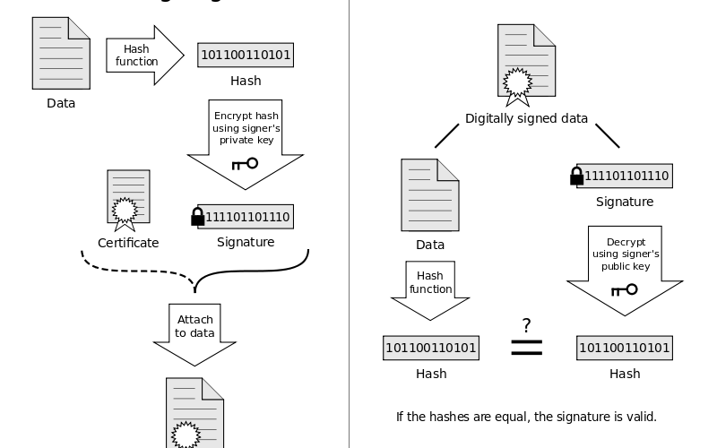

# Whitelist Research

## Objectives of Feature

1. **App Detection Algorithm:** Detect unauthorised applications installed on phone
1. **Whitelist Management:** Easy addition & removal of apps from whitelist
1. **User Notifications:** Clear message to notify unauthorised app is detected (Can be toast message, or even email notification) &rarr; Tells user that own application will shut down
1. **Logging:** Timestamp, details of detected app, record detection as well as removal of unauthorised app
1. **Testing:** Test cases for detecting apps not whitelisted
1. **Documentation**

## App Detection Algorithm

### Methods to uniquely identify APKs
1. **Pacakage Name:**
    - Package name is defined in `AndroidManifest.xml` at beginning of creation of Android application project
    - Eg. `com.example.myapp`
    ```
    <?xml version="1.0" encoding="utf-8"?> 
    <manifest
        xmlns:android="http://schemas.android.com/apk/res/android"
        package="com.example.myapplication"
        android:versionCode="1"
        android:versionName="1.0" >
    ```

1. **Application ID:**
    - Found in app's `build.gradle` file via `applicationId` field
    - Although different names are allowed for package name in manifest file & application ID in gradle file, build tools will copy application ID into APK's manifest file at end of the build &rarr; Might be better to use application ID for app's identity
    ```
    android { 
        defaultConfig { 
            applicationId "com.example.myapplication"
            minSdkVersion 15
            targetSdkVersion 24
            versionCode 1
            versionName "1.0"
        } 
        ... 
    }
    ```
1. **Signature:**
    - Digital signature used to sign application's APK file
    - Allows developers to identify application's author
    - When APK file is installed on Android device, Package Manager verifies that APK has been properly signed with certificate included in APK
    - Can be self-signed or signed by 3rd party
    - **Depiction of signing process** (Source: https://boundarydevices.com/android-security-part-1-application-signatures-permissions/)
      

### Downsides of using Package Name
- Source: https://blog.optickssecurity.com/fake-app-package-names-fraud
- Study estimates that 10 - 24% of listed apps could be labelled as malicious/unwanted which is attributed to fraudsters using fake app package names to masquerade as legitimate apps
- Possible for malicious apps to pretend to be a leigitimate app listed in the whitelist &rarr; Can bypass whitelist and malicious app can run normally while own app is open and being used
- **Conclusion:** Better to use signatures as signatures enforces authenticity of APK (Only legitmate developer has private key) (Source: https://hackernoon.com/how-to-check-whether-the-mobile-app-on-your-phone-is-authentic-or-not-j9gt32lw)


### Application Signatures
#### Types of APK Signing Scheme
1. **v1 Scheme (JAR Signing)**
    - Based on signed JAR
    - Do not protect some parts of APK, such as ZIP metadata &rarr; APK verifier needs to process lots of untrusted data structures & discard data not covered by signatures &rarr; Sizeable attack surface
    - Verifier must uncompress all compressed entries &rarr; Consumes more time & memory
1. **v2 Scheme (introduced in Android 7.0)**
    - Contents of APK are hashed & signed &rarr; Resulting APK signing block inserted into APK &rarr; During validation, APK file is treated as a blob & signature checking is done across entire file &rarr; Any modification to APK, including ZIP metadata modifications invalidates APK signature
      
    - V2 signature of APK is stored as an ID value pair with ID `0x7109871a`
    - Faster & can detect more classes of unauthorized modifications (Not so essential but basically V2+ makes use of merkle tree to speed up signing process via parallel hashing as compared to v1 which calculates hashes for each file entry)
      

1. **v3 Scheme (introduced in Android 9)**
    - V3 adds information about supported SDK versions & a proof-of-rotation struct to APK signing block
    - V3 signature of APK is stored as an ID-value pair with ID `0xf05368c0`
    - Proof-of-rotation is stored inside APK Signature Scheme V3 block under ID 0x3ba06f8c
    - Proof-of-rotation struct allows apps to rotate their signing cert without being blocked on other apps with which they communicate

### Plan to retrieve & verify signatures
1. Retrieve signatures of applications from Play Store (Google PlayStore API) &rarr; Make perhaps a database of legitimate applications from Play Store & their signatures
1. Extract signatures of applications on devices
1. Test if signatures on device match the one from Play Store

### Extraction of signatures of applications on devices
- NOTE: Need to add `<uses-permission android:name="android.permission.QUERY_ALL_PACKAGES"
  tools:ignore="QueryAllPackagesPermission" />` into `AndroidManifest.xml` to allow Package Manger to query the packages in the device (by default it is not allowed due to security reasons )
1. **Extract signatures of installed applications**: Use `PackageManager`'s `getInstalledPackages` method to retrieve package name of all installed applications on device &rarr; Via package name, retrieve signature
    ```kotlin
    fun getInstalledApplications(packageManager: PackageManager): ArrayList<String> {
        val packageNameList = ArrayList<String>()
        try {
            val pm : PackageManager = packageManager
            val packages = pm.getInstalledPackages(PackageManager.GET_META_DATA)
            val packageNames = packages.map { packageInfo -> packageInfo.packageName }

            packageNames.forEach {packageName ->
                packageNameList.add(packageName.toString())
            }

        } catch (e: Exception) {
            Log.e("Error", e.message ?: "Error retrieving installed applications")
        }

        return packageNameList
    }

    // RequiresAPI notation needed to indicate that this code will only execute if Android version >= Pie aka. 9
    @RequiresApi(Build.VERSION_CODES.P)
    fun getSignature(packageManager: PackageManager, packageName: String): String? {
        try {
            val packageInfo: PackageInfo = packageManager.getPackageInfo(packageName, PackageManager.GET_SIGNING_CERTIFICATES)
            val signatures = packageInfo.signingInfo.signingCertificateHistory
            return signatures.toString()
        } catch (e: Exception) {
            Log.e("Error", e.message ?: "Error retrieving signature")
        }
        return null
    }
    ```

1. **Extract Signatures of running applications**: As of now, cannot extract due to the limitations of deprecated methods
- `getRunningServices()`, `getRunningTasks()` are deprecated due to leakage of information (Source: https://developer.android.com/reference/android/app/ActivityManager#getRunningTasks(int))
- Other methods like `getRunningAppProcesses()`